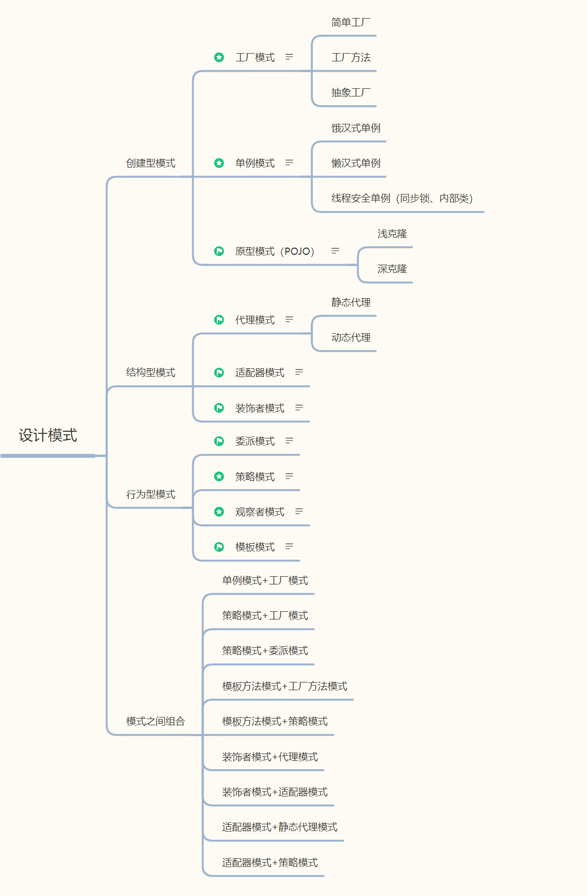

### 概述
设计模式（Design Patterns）是一套被广泛认可的解决特定软件设计问题的解决方案，是一种软件开发思想或思路。它们是在软件开发过程中，对于常见问题的通用可重用解决方案。设计模式不仅仅是代码的复制和粘贴，它们是经过深思熟虑的最佳实践，可以帮助开发者避免重新发明轮子，并促进代码的可维护性和可扩展性。

设计模式通常按照它们解决的问题类型进行分类，主要分为三类：

### 创建型模式（Creational Patterns）
这类模式提供了一种创建对象的方式，以增加现有代码的灵活性和可重用性。主要的创建型模式包括：

单例模式（Singleton Pattern）：确保一个类只有一个实例，并提供一个全局访问点。
工厂方法模式（Factory Method Pattern）：定义创建对象的接口，让子类决定实例化哪一个类。
抽象工厂模式（Abstract Factory Pattern）：提供一个接口，用于创建相关或依赖对象的家族，而不需要明确指定具体类。

### 结构型模式（Structural Patterns）
这类模式关注如何组合类或对象以形成更大的结构，并实现类或对象的组合。主要的结构型模式包括：

适配器模式（Adapter Pattern）：允许将一个类的接口转换成客户希望的另一个接口。
装饰器模式（Decorator Pattern）：动态地给一个对象添加一些额外的职责，就增加功能来说，装饰器模式比生成子类更为灵活。
组合模式（Composite Pattern）：将对象组合成树形结构以表示“部分-整体”的层次结构。

### 行为型模式（Behavioral Patterns）
这类模式特别关注对象之间的通信。主要的行为型模式包括：

观察者模式（Observer Pattern）：定义对象间的一种一对多的依赖关系，当一个对象的状态发生改变时，所有依赖于它的对象都得到通知并被自动更新。
命令模式（Command Pattern）：将一个请求封装为一个对象，从而使你可用不同的请求对客户进行参数化；对请求排队或记录请求日志，以及支持可撤销的操作。
状态模式（State Pattern）：允许一个对象在其内部状态改变时改变它的行为。

### 分类及组合

设计模式的学习和应用对于提高软件设计能力和代码质量有着重要的意义。通过理解和掌握这些模式，开发者可以更加高效地解决软件开发过程中遇到的问题，并能够更好地与团队成员沟通和协作。

